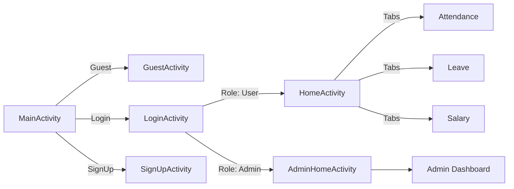

# 📱 Attendance App Online

> A full-featured Android Attendance Management System built with **Kotlin**, **Firebase**, **Room**, and **MVVM Architecture**.  
> Designed for organizations, schools, and teams to track and manage attendance, leaves, and performance in real time.

---

<p align="center">
  
  
  
  
</p>

---

## 🧭 Overview

**Attendance App Online** is a smart mobile attendance tracker with:
- 👥 **Multi-role** access (User/Admin)
- 🔐 **Firebase Authentication**
- 📅 **QR code check-in/out**
- ☁️ **Cloudinary uploads**
- 💾 **Offline cache** with Room
- 🧠 **MVVM** architecture

---

## 🧠 Architecture Overview (Mermaid)

```mermaid
flowchart TD
    A[User] -->|Login / Signup| B(Firebase Auth)
    B --> C[HomeActivity]
    C --> D[AttendanceFragment]
    C --> E[LeaveFragment]
    C --> F[NotificationFragment]
    C --> G[SalaryFragment]
    C --> H[Admin Dashboard]
    D --> I[Room DB Cache]
    H --> J[Firebase Database]
    E --> K[Cloudinary Upload]
````

📐 **MVVM Pattern**

```mermaid
graph TD
  A[Activity / Fragment] -->|Observe| B[ViewModel]
  B -->|Expose State| A
  B -->|Request Data| C[Repository]
  C -->|Sync| D[(Firebase)]
  C -->|Cache| E[(Room Database)]
```

---

## 🧱 Project Structure

```
attendance-app-online/
├── app/
│   ├── activities/          # Login, SignUp, Home, AdminHome
│   ├── fragment/            # Attendance, Leave, Salary, etc.
│   ├── data/                # Data models (User, Leave, TimeManager)
│   ├── utils/               # Helpers and observers
│   ├── res/                 # Layouts, drawables, fonts, menus
│   └── AndroidManifest.xml
├── build.gradle.kts
├── settings.gradle.kts
└── README.md
```

---

## 🧩 Tech Stack

| Category     | Technology                  |
| ------------ | --------------------------- |
| Language     | Kotlin                      |
| Architecture | MVVM                        |
| Backend      | Firebase Auth & Realtime DB |
| Storage      | Room Database               |
| Cloud Upload | Cloudinary                  |
| UI           | Material Design 3           |
| QR           | ZXing Scanner               |
| Build        | Gradle (KTS DSL)            |

---

## ⚙️ Key Features

| 🔹  | Feature          | Description                          |
| --- | ---------------- | ------------------------------------ |
| 👥  | Multi-role       | Admin/User with different dashboards |
| 📲  | QR Attendance    | Scan to mark check-in/out            |
| 🔐  | Firebase Auth    | Secure login/sign-up                 |
| 🗓️ | Leave Requests   | Submit, approve, reject              |
| ☁️  | Cloud Upload     | Attachments via Cloudinary           |
| 🧠  | MVVM             | Clean and testable codebase          |
| 💾  | Room             | Offline data persistence             |
| 📊  | Analytics        | Monthly summaries, attendance rate   |
| 📡  | Network Observer | Live connectivity detection          |

---

## 🧰 Dependencies (Highlights)

```kotlin
implementation("org.jetbrains.kotlin:kotlin-stdlib:1.9.22")

// AndroidX & Material
implementation("androidx.appcompat:appcompat:1.7.0")
implementation("com.google.android.material:material:1.12.0")

// Firebase
implementation("com.google.firebase:firebase-auth")
implementation("com.google.firebase:firebase-database")
implementation("com.google.firebase:firebase-storage-ktx")

// Room
implementation("androidx.room:room-runtime:2.7.0")
kapt("androidx.room:room-compiler:2.7.0")

// ZXing QR Scanner
implementation("com.journeyapps:zxing-android-embedded:4.3.0")

// Coroutines
implementation("org.jetbrains.kotlinx:kotlinx-coroutines-android:1.7.3")
```

---

## 🚀 Getting Started

### Prerequisites

* Android Studio **2022.3+**
* Kotlin **1.9+**
* Firebase Project setup

### Installation

```bash
git clone https://github.com/kuriboh23/attendance-app-online.git
cd attendance-app-online
```

* Add `google-services.json` inside `/app`
* Sync Gradle and build

### Run

```bash
./gradlew assembleDebug
```

---

## 🧭 Navigation Flow



---

## 👥 Roles

| Role     | Capabilities                                  |
| -------- | --------------------------------------------- |
| 👤 User  | Check-in/out, apply for leave, view summaries |
| 👑 Admin | Approve/reject leaves, monitor attendance     |

---

## 🗂️ Data Model Examples

### User

```kotlin
User(
  name = "John",
  lastName = "Doe",
  email = "john@example.com",
  role = "user"
)
```

### Leave

```kotlin
Leave(
  type = "Sick",
  startDate = "2025-03-02",
  endDate = "2025-03-03",
  status = "Pending",
  attachmentUrl = "cloudinary_url"
)
```

---

## 📸 Screenshots

```md


```

---

## 🌩️ Cloudinary Integration

> Leave attachments are uploaded automatically.

Flow:

```
Bitmap -> Temp File -> Cloudinary -> Secure URL -> Firebase
```

---

## 🧪 Testing

```bash
./gradlew test
./gradlew connectedAndroidTest
```

---

## 🔮 Future Roadmap

* [x] Push notifications (FCM)
* [ ] Biometric login
* [ ] Dark mode
* [ ] PDF/CSV report export
* [ ] Web dashboard (Admin)

---

## 🤝 Contributing

1. Fork it 🍴
2. Create feature branch
3. Commit changes
4. Open Pull Request 🚀

---

## 📜 License

Licensed under the **MIT License** – see [LICENSE](LICENSE).

---

## 👨‍💻 Author

**Kuriboh23**
Android Developer | Firebase Enthusiast
🌐 [GitHub Profile](https://github.com/kuriboh23)

---

> ✨ “Built with Kotlin, Firebase, and purpose — to simplify attendance tracking.”
